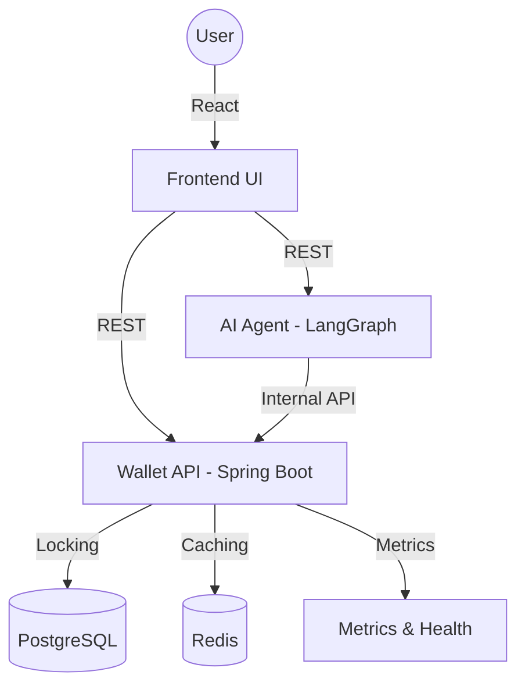

# Robust Wallet System (with AI Assistant)

A high-performance, concurrent, and scalable e-wallet management system built with **Spring Boot 3**, featuring a **React 19** frontend and an intelligent **LangGraph-powered AI Chatbot**.


## Key Features

### Core Banking Operations
- **User Authentication**: Secure Login/Register using **JWT (JSON Web Tokens)**.
- **Wallet Persistence**: Support for **Deposit**, **Withdraw**, and **Transfer** between wallets.
- **Transaction History**: Advanced filtering and pagination for transaction logs.

### AI-Powered Assistant
- **Natural Language Chat**: Talk to your wallet. Ask "How much is my balance?" or "What's my spending history?".
- **Spending Insights**: Automated categorization (Food, Shopping, etc.) and financial coaching.
- **Floating Chat UI**: Integrated directly into the Dashboard for a seamless experience.

### Reliability & Integrity
- **Concurrency Control**: Implements **Pessimistic Locking** (`SELECT FOR UPDATE`) to prevent race conditions.
- **Idempotency**: Protects against duplicate transactions using a custom `Idempotency-Key` header.
- **Real-time Webhooks**: Simulated payment completions (MoMo/VNPay) with callback flows.

### ⚡ Performance & Monitoring
- **Redis Caching**: Sub-millisecond response times for balance inquiries via Cache-aside strategy.
- **System Monitoring**: Integrated **Spring Boot Actuator** with **Micrometer** metrics.

---

## Tech Stack

| Component | Technology |
| :--- | :--- |
| **Backend** | Spring Boot 3.4, Java 21, PostgreSQL, Redis, RabbitMQ |
| **Frontend** | React 19, Vite, Axios, Lucide Icons |
| **AI Agent** | Python 3.12, LangGraph, LangChain, FastAPI, OpenAI GPT-4o |

---

## Getting Started

### Prerequisites
- **Java 21+** & **Python 3.12+**
- **Docker & Docker Compose**
- **Node.js 18+**

### Local Quickstart
1. **Infrastructure**: `docker-compose up -d` (Postgres, Redis, RabbitMQ).
2. **Backend**: `./mvnw spring-boot:run` (at port 8080).
3. **AI Chatbot**: 
   ```bash
   cd chatbot
   uv run python src/server.py  # at port 8000
   ```
4. **Frontend**:
   ```bash
   cd frontend
   npm run dev                  # at port 5173
   ```

---

## System Architecture



---

## Deployment (Render)

This system is designed for cloud-native deployment:
### Chatbot (Python)
- **Deployment**: Web Service on Render.
- **Runtime**: Docker.
- **Root Directory**: `chatbot`.
- **Envs**: `OPENAI_API_KEY`, `WALLET_BACKEND_URL` (your backend URL).

### Frontend (React)
- **Deployment**: Static Site on Render (or Vercel).
- **Root Directory**: `frontend`.
- **Build Command**: `npm install && npm run build`.
- **Publish Directory**: `dist`.
- **Envs (Build-time)**: `VITE_API_BASE_URL`, `VITE_CHATBOT_API_URL`.

## Live Deployment
- **Frontend (UI)**: [https://wallet-frontend-l4te.onrender.com](https://wallet-frontend-l4te.onrender.com)
- **Backend (API)**: [https://wallet-app-k1du.onrender.com](https://wallet-system-8c1f.onrender.com)
- **Chatbot (API)**: [https://wallet-system-8c1f.onrender.com](https://wallet-system-8c1f.onrender.com)
