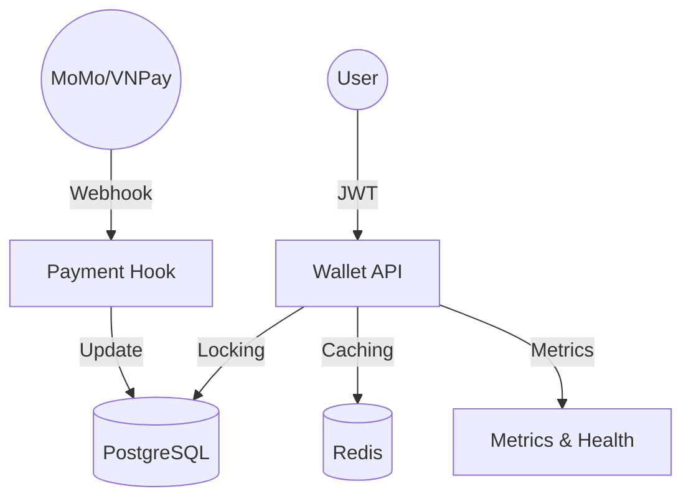

# Robust Wallet System

A high-performance, concurrent, and scalable e-wallet management system built with Spring Boot 3, designed for reliability and data integrity.

## 🚀 Key Features

### 🏦 Core Banking Operations
- **User Authentication**: Secure Login/Register using **JWT (JSON Web Tokens)**.
- **Wallet Persistence**: Support for **Deposit**, **Withdraw**, and **Transfer** between wallets.
- **Transaction History**: Advanced filtering and pagination for transaction logs.

### 🛡 Reliability & Integrity
- **Concurrency Control**: Implements **Pessimistic Locking** (`SELECT FOR UPDATE`) to prevent race conditions during high-frequency transactions.
- **Idempotency**: Protects against duplicate transactions using a custom `Idempotency-Key` header.
- **Event-Driven Architecture**: Asynchronous processing of secondary tasks (like notifications) using Spring's `ApplicationEventPublisher`.

### ⚡ Performance & Monitoring
- **Redis Caching**: Optimized balance retrieval with a **Cache-aside** strategy, ensuring sub-millisecond response times for balance inquiries.
- **System Monitoring**: Integrated **Spring Boot Actuator** with custom **Micrometer** metrics (Success/Failure counters for all operations).
- **Dockerized Environment**: Ready-to-use **Docker Compose** setup for Postgres, Redis, and the Application.

### 🔗 Third-party Integration
- **Simulation of External Webhooks**: Handles asynchronous payment completions (like MoMo/VNPay) with a "Pending -> Success" callback flow.

---

## 🛠 Tech Stack
- **Framework**: Spring Boot 3.4
- **Security**: Spring Security + JWT
- **Database**: PostgreSQL (Production) / H2 (Testing)
- **Caching**: Redis
- **Metrics**: Micrometer + Prometheus (Actuator)
- **Build Tool**: Maven
- **Containerization**: Docker & Docker Compose

---

## 🏁 Getting Started

### Prerequisites
- **Java 21+**
- **Docker & Docker Compose**
- **Maven** (optional, if not using Docker)

### Running with Docker Compose
The easiest way to start the entire stack:
```bash
docker-compose up -d
```
The application will be available at `http://localhost:8080`.

### Running Tests
We maintain high code quality with comprehensive Unit and Integration tests:
```bash
./mvnw test
```

---

## 📖 API Documentation (Summary)

| Method | Endpoint | Description | Auth Required |
| :--- | :--- | :--- | :--- |
| POST | `/auth/register` | Register a new user | No |
| POST | `/auth/login` | Login and get JWT | No |
| GET | `/wallet` | Get current wallet balance | Yes |
| POST | `/wallet/deposit` | Immediate deposit | Yes |
| POST | `/wallet/transfer` | Transfer funds (requires Idempotency-Key) | Yes |
| GET | `/wallet/history` | View paginated transaction history | Yes |
| POST | `/webhooks/momo` | Handle payment provider callbacks | No |

---

## 🏗 System Architecture



---

## 📜 License
Internal Project - For educational and professional demonstration purposes.
